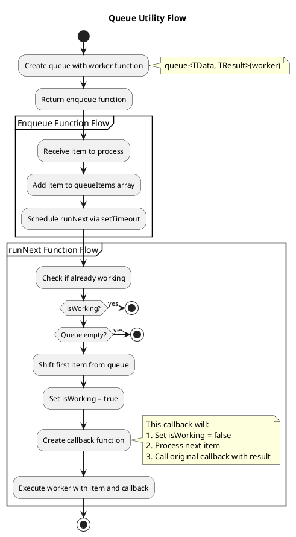
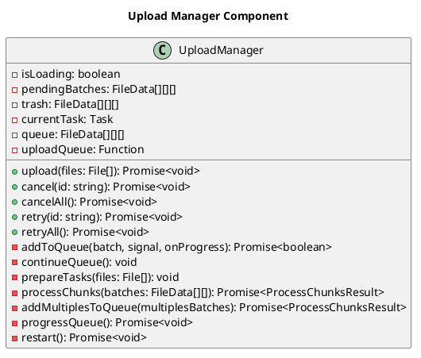
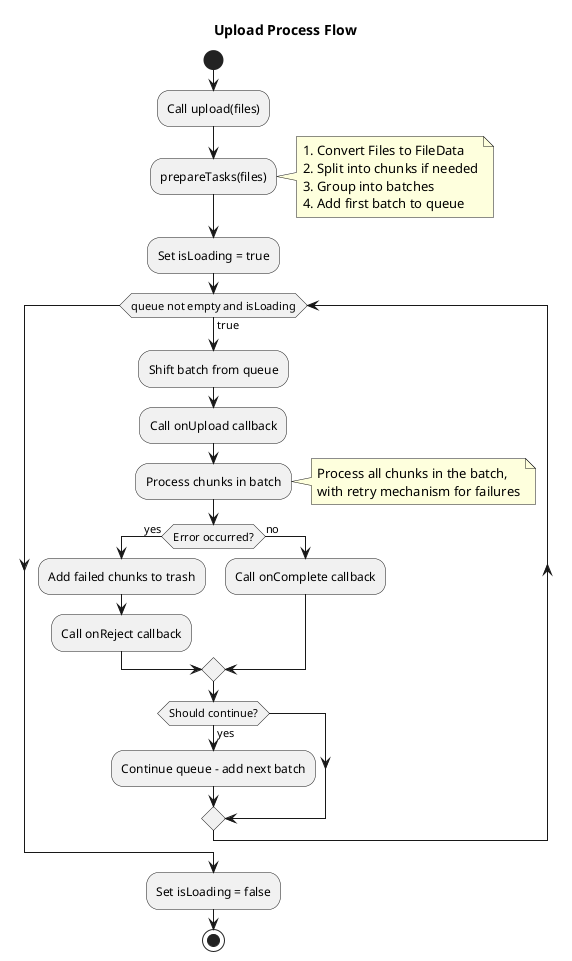
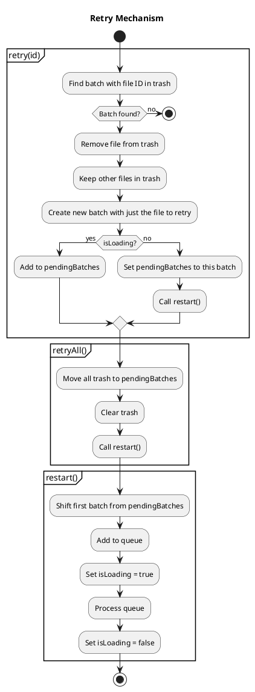
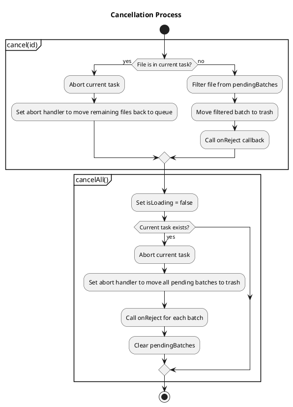
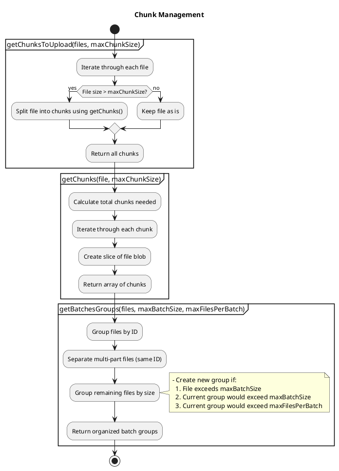
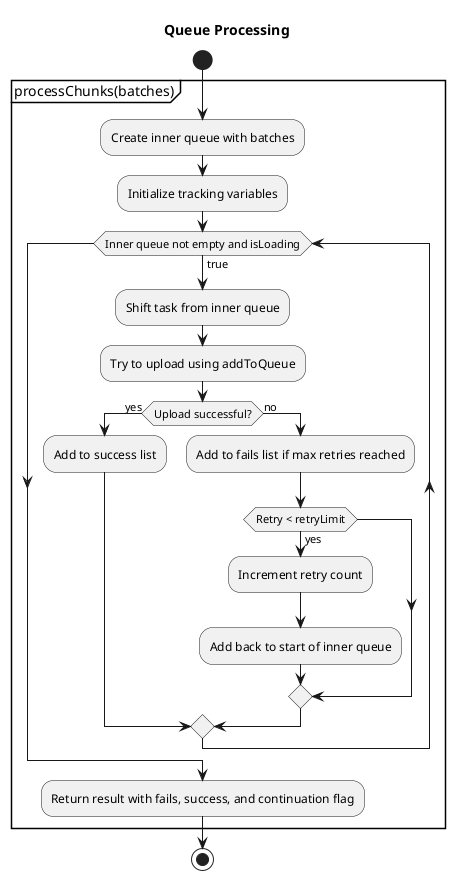

# Upload Manager Flow Documentation

This document provides detailed flow diagrams for the upload manager utilities, explaining how each component works and interacts with others.

## Table of Contents

- [Queue Utility](#queue-utility)
- [Upload Manager](#upload-manager)
- [Upload Process Flow](#upload-process-flow)
- [Retry Mechanism](#retry-mechanism)
- [Cancellation Process](#cancellation-process)
- [Chunk Management](#chunk-management)

## Queue Utility

The queue utility is a generic implementation that processes items one by one using a worker function.

## Upload Manager

The Upload Manager orchestrates the file upload process, handling batching, retries, and progress tracking.

## Upload Process Flow

The following diagram illustrates the complete flow of the upload process.

## Retry Mechanism

The retry mechanism handles failed uploads and allows retrying specific files or all files.

## Cancellation Process

The following diagram shows how the cancellation process works.

## Chunk Management

This diagram illustrates how files are split into chunks and batches.

## Queue Processing

This diagram shows how the items are processed in the queue.

